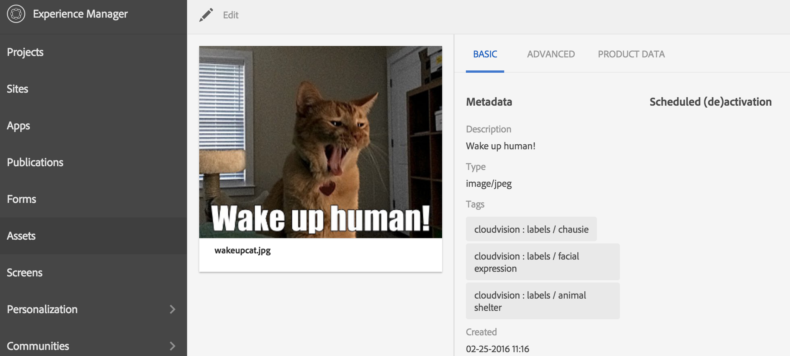
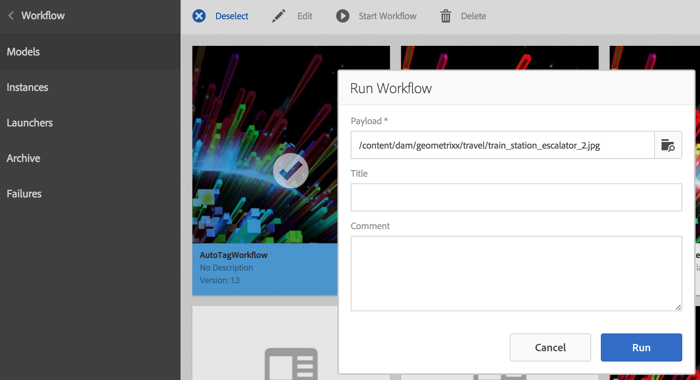

Adobe AEM auto tagging with Google Cloud Vision
========

Sample project using [Google Cloud Vision API](https://cloud.google.com/vision/docs/)  to autotag assets within Adobe AEM DAM. 

It contains a workflow with 3 process steps:
- Auto Text -> Detect Text in an image, and assign the detected text to the description metadata field.
- Auto Label -> Tag images with the labels detected by the Vision API
- Auto Landmark -> Tag images with landmarks detected by the Vision API.

The tags are created with namespace cloudvision. 

An example result using a Google test image can be seen in this screenshot:



Running
--------
To run the application, first setup the Cloud Vision API.
* Create a project with the [Google Cloud Console](https://console.cloud.google.com), and enable
  the [Vision API](https://console.cloud.google.com/apis/api/vision.googleapis.com/overview?project=_).
* Set up your environment with [Application Default Credentials](https://cloud.google.com/docs/authentication#developer_workflow). For
    example, from the Cloud Console, you might create a service account,
    download its json credentials file, then set the appropriate environment
    variable:

    ```bash
    export GOOGLE_APPLICATION_CREDENTIALS=/path/to/your-project-credentials.json
    ```
    
* Start your AEM instance in this environment.
* Start the AutoTag workflow and select an asset.
 | 

Building
--------

This a content package project generated using the multimodule-content-package-archetype. This project uses Maven for building. Common commands:

From the root directory, run ``mvn -PautoInstallPackage clean install`` to build the bundle and content package and install to a CQ instance.

From the bundle directory, run ``mvn -PautoInstallBundle clean install`` to build *just* the bundle and install to a CQ instance.

Using with VLT
--------------

To use vlt with this project, first build and install the package to your local CQ instance as described above. Then cd to `content/src/main/content/jcr_root` and run

    vlt --credentials admin:admin checkout -f ../META-INF/vault/filter.xml --force http://localhost:4502/crx

Once the working copy is created, you can use the normal ``vlt up`` and ``vlt ci`` commands.

Specifying CRX Host/Port
------------------------

The CRX host and port can be specified on the command line with:
mvn -Dcrx.host=otherhost -Dcrx.port=5502 <goals>


